# Centre of the Bend

### Bending Large Diameter Conduit - $$1\frac{1}{2}$$" to $$4$$" 

To bend larger diameter conduit with an 'hour clock' bender for example one can use a method that I know as: 'Centre of the Bend'.

For bending $$\frac{1}{2}$$" to $$1$$" one can use the suggestions from [the Hand Bending](./hand_bending.md) portion of this chapter.

**The following are the steps, in a read-do checklist format that I follow each time for best results**

---------------------------------------------------------------

**Step-1:** Mark the front of the 'shoe' on a straight piece of conduit appropriate for the job.

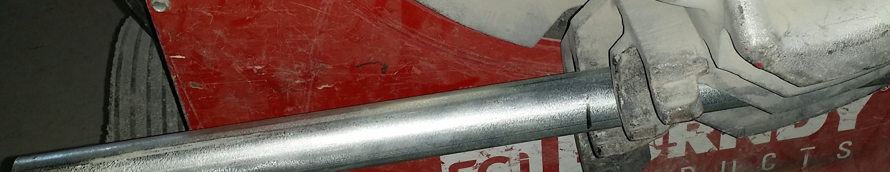

**Step-2:** Bend to an angle of your choice that will allow enough distance between bends based of the amount to offset. Example for an offset of 5" with a 2" conduit, I would choose an angle below $$\approx{30}\degree$$. *Remember the angle which you have chosen*.

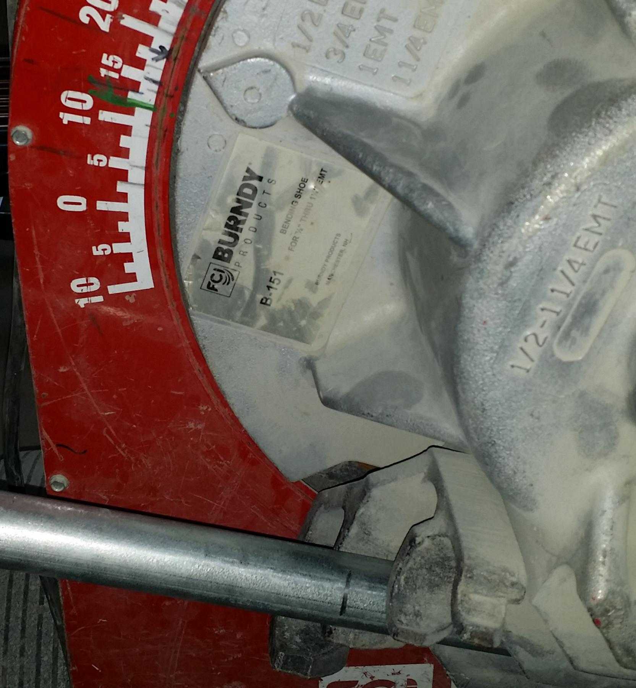

**Step-3:** Find the centre of that bend using a straight edge (I use my level). This is accomplished by placing the straight edge parallel to each inside edges of the bend, which will form an 'X'; this marks the centre of the bend. This is that part in a movie where an actor says that title!

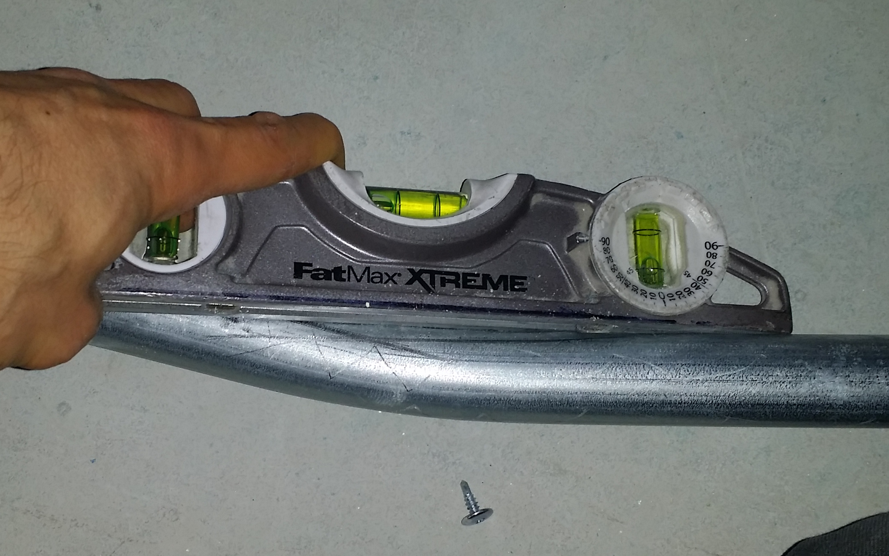 

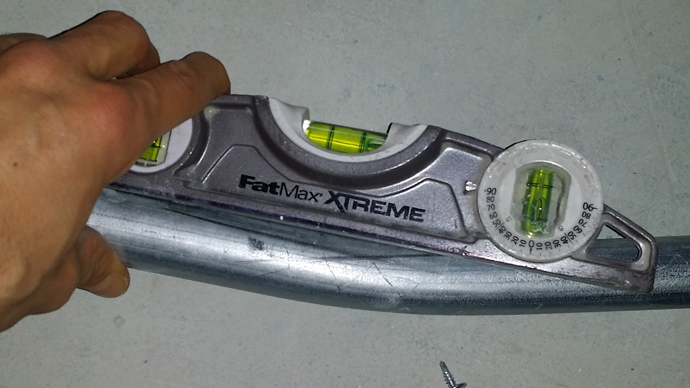

**Step-4:** Measure the distance from the first mark (the front of the shoe) and the centre of the bend mark. Place a mark, $$\phi$$.

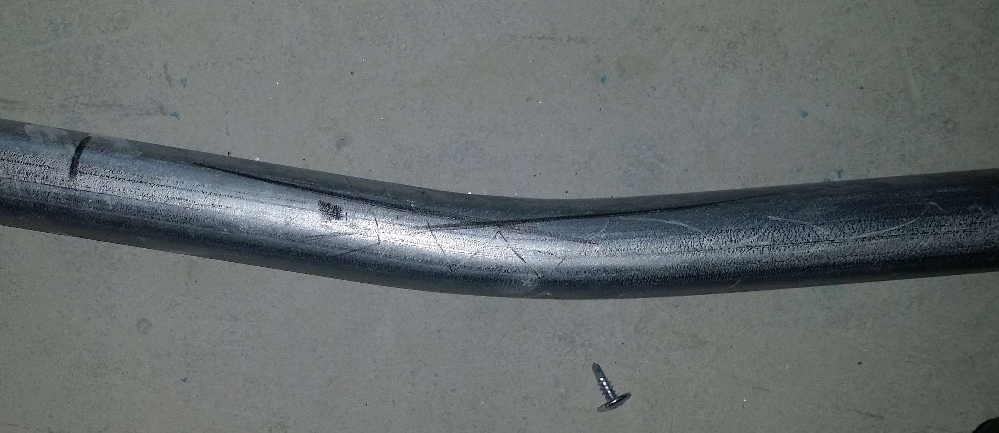

**Step-5:** Place a long straight edge parallel to the outside edge of the bend on the short end side and measure the required offset distance from that straight edge to the conduit. Place a mark, $$\psi$$.

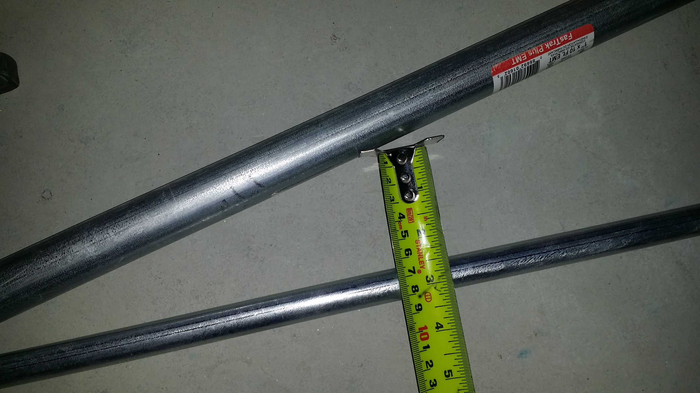

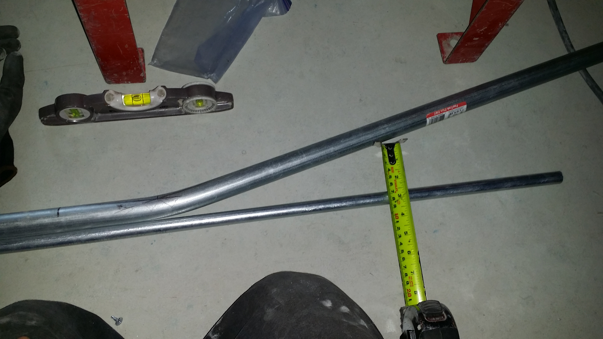

**Step-6:** Using the distance found in step-4 $$\phi$$, measure back toward the bend from the mark made in step-5. Place a mark, $$\omega$$.

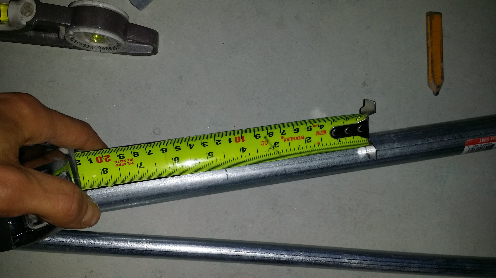

**Step-7:** Place the conduit back in the bender placing the mark made in step-6 $$\omega$$ inline with the front of the shoe.

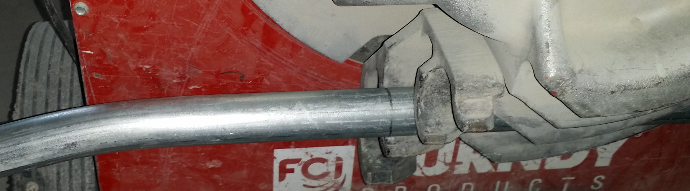

**Step-8:** Bend back to the original angle from step-2. This is where fine touch comes in with the button on the bending machine.

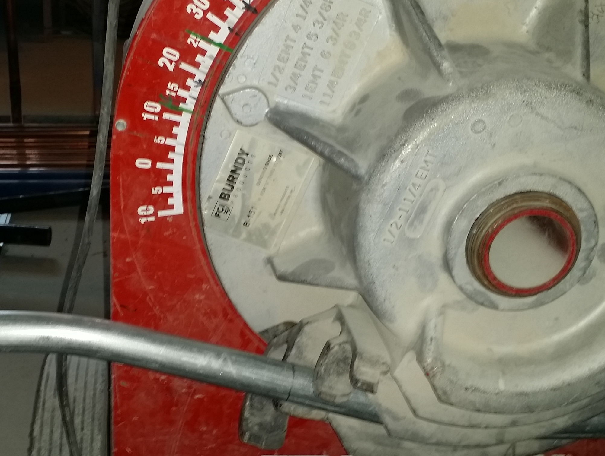

**Step-9:** Check your work and see how you did. In the picture I have my desired offset distance but the level is off slightly; cannot always be perfect.

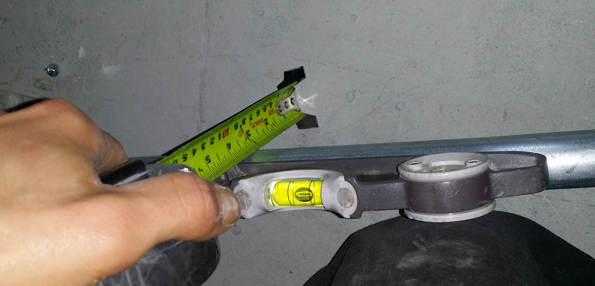

